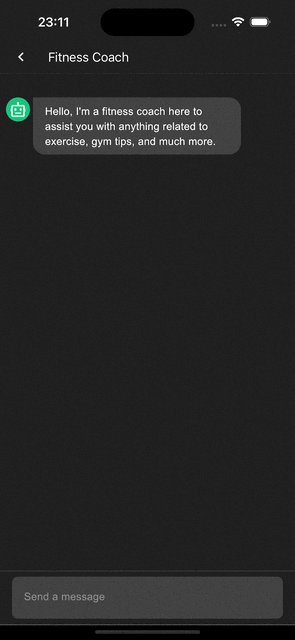
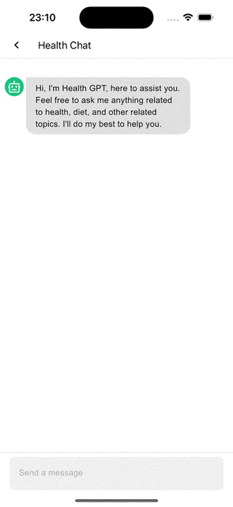

[](https://opensource.org/license/apache-2-0/)


# ChatBot Builder SDK

Welcome to the ChatBot Builder SDK, a powerful tool that enables developers to effortlessly create and integrate chatbots into their applications. With our SDK, you can seamlessly customize the Chat UI to match the look and feel of your application, while also having the ability to define specific instructions for the bot's behavior.

## 🧬 Key Features
- **Intuitive Interface**: Our SDK provides a user-friendly interface that makes chatbot creation a breeze. Developers of all skill levels can easily build and deploy chatbots without extensive coding knowledge;
- **Customizable Chat UI**: Tailor the appearance of the chatbot to seamlessly blend with your application's design. Personalize the colors and layout to create a consistent and engaging user experience;
- **Behavior Customization**: Define the behavior of your chatbot by passing instructions to guide its responses. You have full control over how the bot interacts with users, ensuring it aligns perfectly with your application's requirements;
- **Cross-Platform Compatibility**: Our SDK supports both Android and iOS platforms, allowing you to reach a wider audience and deliver consistent chatbot experiences across different devices;
- **Powered by [OpenAI API](https://beta.openai.com/docs/api-reference)**: Leveraging the cutting-edge capabilities of the [OpenAI API](https://beta.openai.com/docs/api-reference), our SDK ensures that your chatbot is equipped with state-of-the-art natural language processing and machine learning capabilities.

## 📽️ Showcases

|                         Fitness Coach                         |                         Health GPT                          |
|:-------------------------------------------------------------:|:-----------------------------------------------------------:|
|  |  |

## ⚡️ Getting Started

First, you need to obtain the OpenAI API Key, which can be acquired from your [OpenAI Platform Account](https://platform.openai.com/account/api-keys).

> **Note**: OpenAI encourages using environment variables for the API key. [Read more](https://help.openai.com/en/articles/5112595-best-practices-for-api-key-safety).

### iOS setup

ChatBot Builder supports iOS 14.1+ and Xcode 12.1+. We are using CocoaPods as dependency manager. Add the following to your Podfile:

```ruby
pod 'ChatBotBuilder', :git => 'https://github.com/hexa-scribe/chatbot-builder.git', :tag => '0.0.1'
```

See the code snippet below on how to initialize and use the SDK in SwiftUI:

```swift
struct MyViewControllerWrapper: UIViewControllerRepresentable {
    func makeUIViewController(context: Context) -> UIViewController {
        let defaultColorsBuilders = ChatBot.DefaultColorsBuilder()
            .setSendButtonColor(color: UIColor.purple)
            .setInputFieldFocusedIndicatorColor(color: UIColor.purple)
        
        let chatBot = ChatBot.Builder(apiKey: "YOUR_OPEN_AI_KEY")
            .setDefaultColorsBuilder(defaultColorsBuilder: defaultColorsBuilders)
            .setDarkMode(isEnabled: false)
            .addMessage(role: .assistant, content: "Hi, how can I help you today?")
            .addPreSeededMessage(role: .assistant, content: "You are a helpful seller car assistant")
            .setInputFieldBorderWidth(borderWidth: 1)
            .build()
        
        return chatBot.getViewController()
    }

    func updateUIViewController(_ uiViewController: UIViewController, context: Context) {
        // Implement this method if you need to update the UIViewController based on changes in SwiftUI
    }
}
```

### Android setup

Add the following line to import the library via Gradle. First, make sure Maven Central has been added:


```kotlin
repositories {
    mavenCentral()
    // ...
}
```

Then, simply import the dependency to your `build.gradle` dependencies:

```kotlin
implementation("io.github.hexascribe:chatbot-builder:0.0.1")
```

Take a look at the Kotlin code snippet below for an example of how to initialize and use the SDK:

```kotlin
@Composable
fun ChatScreen() {
    val chatBot = ChatBot.Builder("YOUR_OPEN_AI_KEY")
        .setDarkMode(true)
        .addMessage(RoleEnum.ASSISTANT, "Hi, how can I help you today?")
        .addPreSeededMessage(RoleEnum.SYSTEM, "You are a helpful seller car assistant")
        .setInputFieldBorderWidth(1)
        .build()
    chatBot.ComposeScreen()
}
```

## ℹ️ Sample apps

Take a look at our sample apps to learn how to use the SDK on different platforms:

[Android Sample](samples/android)
<br />
[iOS Sample](samples/ios)

## 🤝 Contributions

Feel free to make a suggestion or if you find any error in this project, please open an issue. Make sure to read our [contribution guidelines](CONTRIBUTING.md) before.

## 📄 License

```
    Copyright 2023 Hexa Scribe

    Licensed under the Apache License, Version 2.0 (the "License");
    you may not use this file except in compliance with the License.
    You may obtain a copy of the License at

        http://www.apache.org/licenses/LICENSE-2.0

    Unless required by applicable law or agreed to in writing, software
    distributed under the License is distributed on an "AS IS" BASIS,
    WITHOUT WARRANTIES OR CONDITIONS OF ANY KIND, either express or implied.
    See the License for the specific language governing permissions and
    limitations under the License.
```

**Please note that the ChatBot Builder SDK is an unofficial library. It is not directly affiliated with or endorsed by OpenAI**. However, we strive to provide a reliable and feature-rich tool to enhance your chatbot development experience.